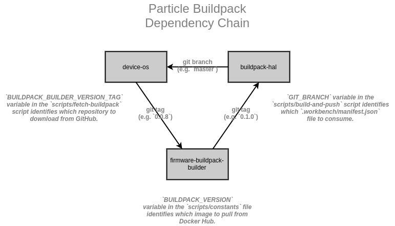

Updating Build Environment
==========================

Generating the build system environment requires several moving parts. There are multiple repositories that are linked together in order to create a buildpack system.

Repositories
------------

There are four main repositories involved in generating the environment.

- [`buildpack-hal`](https://github.com/particle-iot/buildpack-hal/): Contains the `Dockerfile` that specifies the contents of the environment, which is consumed by CI, CD, WebIDE and the Workbench.
- [`device-os`](https://github.com/particle-iot/device-os/): Contains the `.workbench/manifest.json` file, which specifies the necessary components.
- [`firmware-buildpack-builder`](https://github.com/particle-iot/firmware-buildpack-builder/): Contains the Dockerfile fragments, which are used during CI to validate builds and create the images consumed by the WebIDE compiler.
- [`workbench`](https://github.com/particle-iot/workbench/)*: Contains the dependency installer script that consumes the manifest file from the `device-os` repository.

Relationship Mapping
--------------------

Examples
--------

### Upgrading the `gcc-arm` compiler

1. Create the dependency bundle

   1. Download the dependency for your platform
   1. [Create a bundle](https://github.com/particle-iot/workbench#development)
   1. Generate a SHA-256 hash for the bundle
   1. Upload the bundle to Amazon S3

1. Update `device-os`

   1. Update `<particle-iot/device-os>/.workbench/manifest.json` to reflect the new dependency
   1. Update the `BUILDPACK_BUILDER_VERSION_TAG` variable to tell Travis CI to use the new `branch` or `tag` from `<particle-iot/device-os>/scripts/fetch-buildpack`
   1. Push a new branch to the `particle-iot/device-os` repository

   > _**NOTE:** Travis CI will fail, because the new `branch` or `tag` in `firmware_buildpack_builder` can't exist due to the circular dependency (depicted above)._

1. Update `buildpack-hal`

   1. Update the `GITHUB_BRANCH` variable in the `build-and-push` script, to identify which `device-os` branch will provide the updated version of the manifest file
   1. Update the `COPY` command in the `Dockerfile` to copy the new dependency from the `worker` stage to the `buildpack-hal` stage
   1. Tag the commit with a version to be used. (i.e. `0.1.0`)
   1. Push a new branch to the `particle-iot/buildpack-hal` repository

1. Update `firmware-buildpack-builder`

   1. Update `BUILDPACK_VERSION` in `<particle-iot/device-os>/scripts/constants` to reflect the name of the tag provided to `buildpack-hal`, which was used to tag the resulting Docker image
   1. Push a new branch to the `firmware-buildpack-builder` repository

1. Restart the original `device-os` Travis CI job _(above)_